# 🔧 New Conditional Installation Logic

## 📋 Overview

The new installation logic implements a two-step workflow to create installation tasks:

1. **Payment confirmed** → Creation of **Site Survey** only
2. **Survey approved** → Creation of **Installation** according to specific conditions

This approach ensures that installation only begins after complete technical validation of the site.

## 🎯 Objectives

- **Prior technical validation**: Ensure the site is technically viable before installation
- **Additional costs management**: Allow the client to approve and pay for additional equipment identified
- **Flexible workflow**: Adapt the process according to installation complexity

## 🔄 Detailed Workflow

### Step 1: Order Payment

```text
Client pays order → Order.payment_status = "paid" → Automatic SiteSurvey creation
```

**Before (old logic):**

```python
# In Order.save()
if self.payment_status == "paid":
    # ❌ Simultaneous creation of SiteSurvey AND InstallationActivity
    create_site_survey()
    create_installation_activity()  # Too early!
```

**Now (new logic):**

```python
# In Order.save()
if self.payment_status == "paid":
    # ✅ SiteSurvey creation only
    create_site_survey()
    # InstallationActivity will be created after survey approval
```

### Step 2A: Survey Without Additional Costs

```mermaid
graph TD
    A[Survey Completed] --> B{Additional costs?}
    B -->|No| C[Survey Approved]
    C --> D[✅ InstallationActivity Created]
    D --> E[Installation can begin]
```



**Code:**

```python
# In SiteSurvey.save()
if self.status == "approved" and not self.requires_additional_equipment:
    # ✅ Immediate InstallationActivity creation
    self.create_installation_activity()
```

### Step 2B: Survey With Additional Costs

```mermaid
graph TD
    A[Survey Completed] --> B{Additional costs?}
    B -->|Yes| C[Survey Approved]
    C --> D[AdditionalBilling Generation]
    D --> E[Client receives billing]
    E --> F{Client approves?}
    F -->|No| G[❌ Installation blocked]
    F -->|Yes| H[Status: approved]
    H --> I{Client pays?}
    I -->|No| J[⏳ Awaiting payment]
    I -->|Yes| K[Status: paid]
    K --> L[✅ InstallationActivity Created]
    L --> M[Installation can begin]
```



**Code:**

```python
# In SiteSurvey.save()
if self.status == "approved" and self.requires_additional_equipment:
    # ❌ InstallationActivity NOT created
    # Wait for AdditionalBilling payment

# In AdditionalBilling.save()
if self.status == "paid" and self.survey.status == "approved":
    # ✅ Now create InstallationActivity
    self.survey.create_installation_activity()
```

## 🔧 Technical Implementation

### 1. SiteSurvey Model

**Method `create_installation_activity()`:**

```python
def create_installation_activity(self):
    """
    Create InstallationActivity according to conditions:
    - Without additional costs: Immediately after approval
    - With additional costs: After billing payment
    """
    from main.models import InstallationActivity

    if self.requires_additional_equipment:
        # Check that billing is paid
        if hasattr(self, 'additional_billing') and self.additional_billing.status == 'paid':
            # Create installation with billing reference
            installation_activity, created = InstallationActivity.objects.get_or_create(
                order=self.order,
                defaults={
                    "notes": f"Installation after survey approval and cost payment. Survey: {self.id}, Billing: {self.additional_billing.billing_reference}",
                    "location_confirmed": True,
                }
            )
        else:
            # Additional costs not yet paid
            return None, False
    else:
        # No additional costs, create immediately
        installation_activity, created = InstallationActivity.objects.get_or_create(
            order=self.order,
            defaults={
                "notes": f"Installation after survey approval (no additional costs). Survey: {self.id}",
                "location_confirmed": True,
            }
        )

    return installation_activity, created
```

**Method `can_create_installation()`:**

```python
def can_create_installation(self):
    """Check if installation can be created"""
    if self.status != "approved":
        return False

    if not self.requires_additional_equipment:
        return True

    if hasattr(self, 'additional_billing'):
        return self.additional_billing.status == 'paid'

    return False
```

### 2. AdditionalBilling Model

**Automatic triggering:**

```python
def save(self, *args, **kwargs):
    # Detect status change to 'paid'
    previous_status = None
    if self.pk:
        try:
            previous_status = AdditionalBilling.objects.get(pk=self.pk).status
        except AdditionalBilling.DoesNotExist:
            pass

    # Calculations and timestamps...
    super().save(*args, **kwargs)

    # 🎯 Key point: Create InstallationActivity when billing is paid
    if self.status == "paid" and previous_status != "paid":
        if self.survey.status == "approved":
            self.survey.create_installation_activity()
```

### 3. Order Model

**Simplification:**

```python
def save(self, *args, **kwargs):
    # Detect payment_status change to 'paid'
    if self.payment_status == "paid" and prev_payment_status != "paid":
        # ✅ Create ONLY the SiteSurvey
        SiteSurvey.objects.get_or_create(
            order=self,
            defaults={
                "survey_latitude": self.latitude,
                "survey_longitude": self.longitude,
                "status": "scheduled",
            }
        )
        # ❌ No more InstallationActivity creation here
```

## 📊 Before/After Comparison

| Aspect | **Before (Old Logic)** | **Now (New Logic)** |
|--------|------------------------|---------------------|
| **Order payment** | SiteSurvey + InstallationActivity | SiteSurvey only |
| **Survey without costs** | Installation already created | Installation created after approval |
| **Survey with costs** | Installation already created | Installation created after payment |
| **Technical validation** | Optional | Mandatory |
| **Additional costs management** | Complex | Integrated into workflow |

## 🧪 Test Scenarios

### Scenario 1: Standard Installation

```python
# Test: Survey without additional costs
order = create_paid_order()  # → SiteSurvey created
survey = order.site_survey
survey.requires_additional_equipment = False
survey.status = 'approved'
survey.save()  # → InstallationActivity created immediately

assert InstallationActivity.objects.filter(order=order).exists()
```

### Scenario 2: Installation with Additional Costs

```python
# Test: Survey with additional costs
order = create_paid_order()  # → SiteSurvey created
survey = order.site_survey

# Add costs
add_additional_costs(survey)
survey.requires_additional_equipment = True
survey.status = 'approved'
survey.save()  # → InstallationActivity NOT created

assert not InstallationActivity.objects.filter(order=order).exists()

# Create and pay billing
billing = create_additional_billing(survey)
billing.status = 'paid'
billing.save()  # → InstallationActivity created now

assert InstallationActivity.objects.filter(order=order).exists()
```

## ⚠️ Important Points

### 1. **Existing Data Migration**

Already paid orders with InstallationActivity created directly remain unchanged. For new orders, only the new logic applies.

### 2. **Error Handling**

```python
# Check that survey exists before approval
if not hasattr(order, 'site_survey'):
    raise ValueError("Site survey must exist before creating installation")

# Check that billing is complete
if survey.requires_additional_equipment and not hasattr(survey, 'additional_billing'):
    raise ValueError("Additional billing required but not generated")
```

### 3. **Permissions and Security**

- Only the **assigned technician** can identify additional costs
- Only the **owner client** can approve/reject billing
- Only **admins/managers** can generate additional billings

## 🔮 Future Extensions

### 1. **Automatic Notifications**

```python
# When InstallationActivity is created
def notify_installation_ready(installation):
    send_notification(
        to=installation.order.user,
        message=f"Your installation {installation.order.order_reference} is ready to be scheduled"
    )
```

### 2. **Analytics and Reporting**

```python
# Metrics on additional costs
def get_additional_costs_stats():
    return {
        'surveys_with_additional_costs': SiteSurvey.objects.filter(requires_additional_equipment=True).count(),
        'average_additional_cost': AdditionalBilling.objects.aggregate(avg_amount=Avg('total_amount')),
        'approval_rate': calculate_approval_rate()
    }
```

### 3. **Workflow Automation**

```python
# Auto-approval for small amounts
if billing.total_amount <= Decimal('50.00'):
    billing.status = 'approved'
    billing.save()
    send_auto_approval_notification()
```

## 📈 Advantages of the New Logic

1. **🔍 Mandatory Technical Validation** - No installation without approved survey
2. **💰 Cost Transparency** - Client informed and consents to additional costs
3. **⚡ Operational Efficiency** - Automated and predictable workflow
4. **📊 Better Planning** - Installations created only when everything is ready
5. **🛡️ Risk Reduction** - Fewer cancellations and on-site problems

---

This new logic ensures a more robust, transparent and efficient installation process for all stakeholders.
